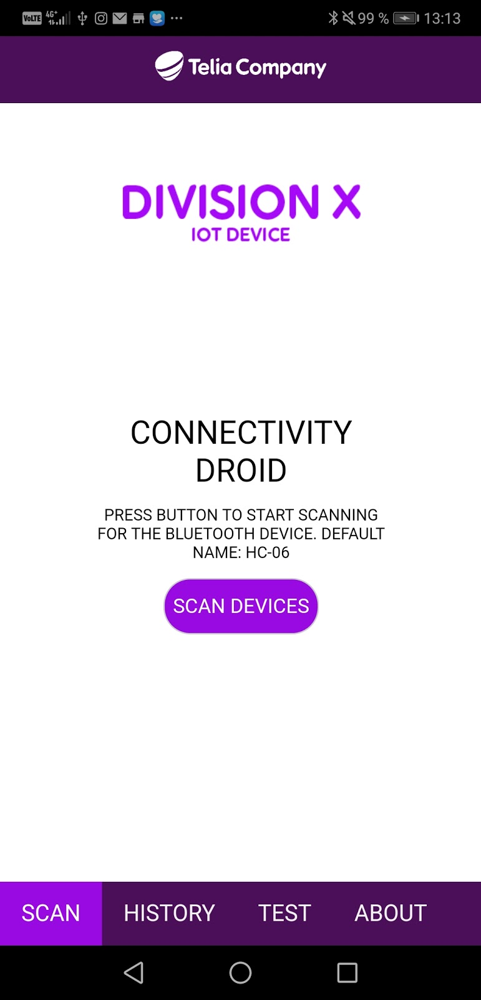
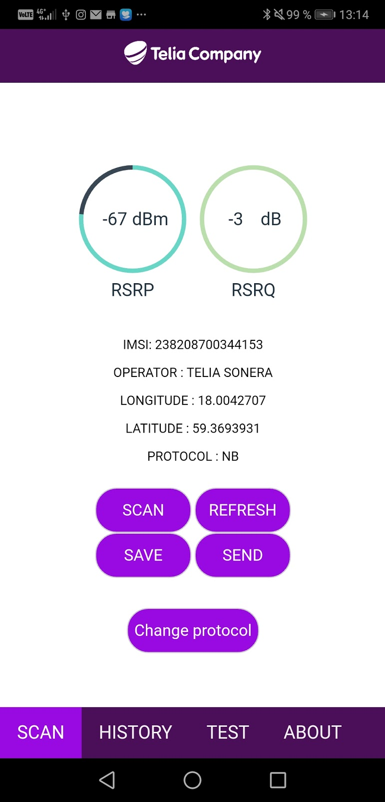
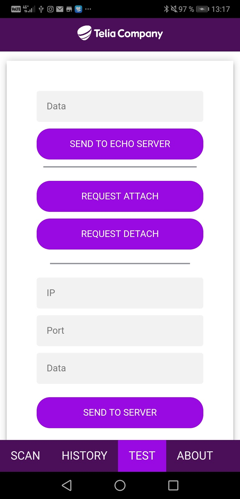

### User Guide Connectivity Droid

## Start up and connecting to device
To discover devices, click on "SCAN DEVICES". Discovery can take up to 15-20 seconds.
The default name of the bluetooth module is HC-06.

## Scan signal and quality
After connecting to device a request for signal power and quality can be done by pressing the “SCAN” button.

Device will send IMSI and current protocol status after connecting which will be displayed at the scan page.

Longitude and latitude are also available and will be updated once per minute in the Android application. This will not be used where the phone dont have a valid GPS signal.

To refresh what cell the device connects to push the REFRESH button. The device may say “searching..” a few seconds after a successful refresh since it is trying to get a new signal.

*OBS: Change protocol is not supported in this version.
Sending data to Azure is not supported in this version, see test page to send data to a test server.*

## Test basic functionality on nw
A test page for some basic testing on the network.

##### Send data to echo server

Input data and press “SEND TO ECHO SERVER” to test sending data through the network. 200 character limit. (ÅÄÖ not supported).

You will get the echoed answer on the screen.

##### Send data to any server

Input IP, port and data to send to your own test server.

*Not supported in this version.*

##### Request network attach

Requests a simple attach to the network.

#### Request network detach

Requests a simple detach to the network.

## Save measurements
You can save a measurement point by pressing the SAVE button.

*Not yet supported.
In this version it is only supported to see timestamp and used network in a list under the history page and only during the active session.
Although the measurement point is saved with position and signal information it is not yet displayed for the user.
Functionality to manage saved data over sessions (send to cloud (Azure)/ delete etc.) will be implemented.
In case of issues using the solution in this stage, restart the device and the application.*
